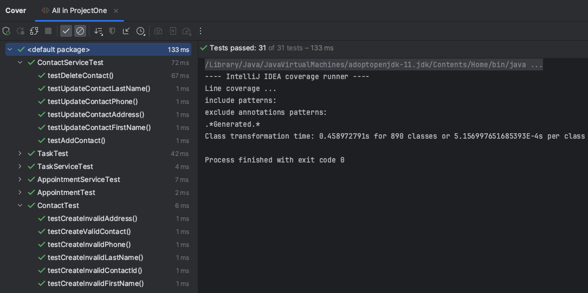
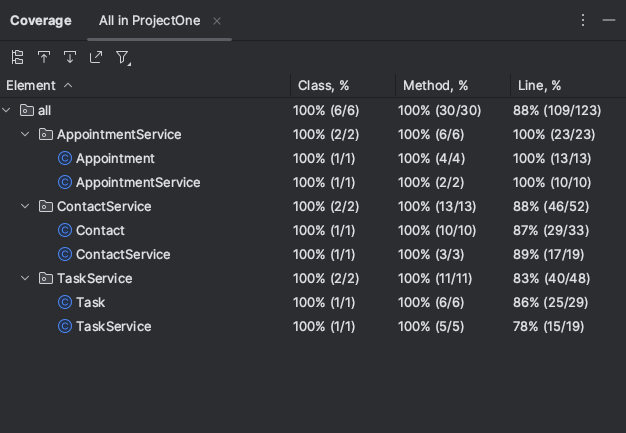
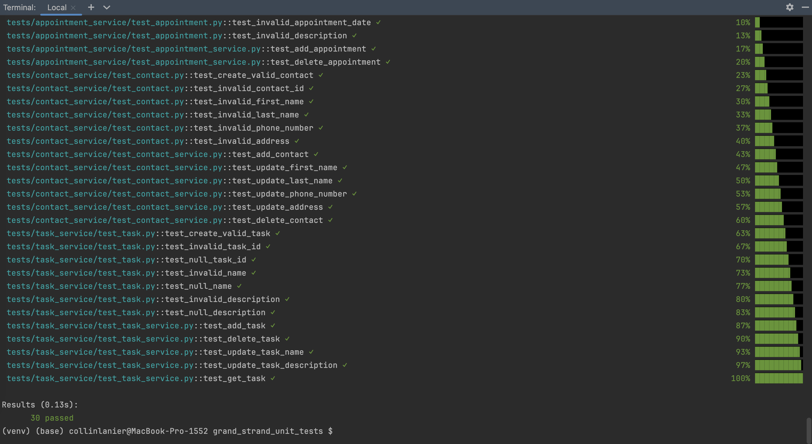
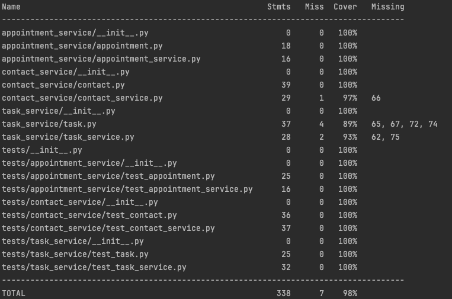

# Grand Strand Unit Tests

This project is a unit testing suite for a "future" mobile application for the client "Grand Strand." The system includes three main services: Contact,Task, and Appointment. Each service is supported by its own class and respective unit tests.

You can observe the difference between the original and enhanced artifacts through my pull request: [Enhanced artifact using pytest](https://github.com/collinlanie12/capstone-artifact-1/pull/1)

## Project Overview
This project is designed to validate the functionality of three core service modules:
- **Contact**: Manages user contact information (names, phone numbers, addresses, etc.).
- **Task**: Handles to-do tasks with IDs, names, and descriptions.
- **Appointment**: Manages scheduled events that require a future date and description.

Each service includes validation and logic that is thoroughly tested using edge cases and exception handling.

## Features
- Clean, modular service class architecture
- Fully rewritten unit tests in Python using `pytest`
- Exception handing and validation tested
- Reusable test cases with future-date logic for appointments

## Technologies Used
- Python 3.8.5
- `pytest`
  
_Original version: Java, JUnit_

## Getting Started
To run this project locally and execute the unit tests:

1. **Clone the repository**
   ```bash
   git clone https://github.com/collinlanie12/capstone-artifact-1.git
   cd capstone-artifact-1
   ```
2. Install Dependencies
   ```bash
   pip install -r requirements.txt
   ```
3. Run the Tests
   ```bash
   pytest
   ```

### (Optional) to test with coverage
```bash
pip install coverage
coverage report -m
```
   

## Project Screenshots

### Original Artifact



### Enhanced Artifact



## Author
Collin Lanier

Southern New Hampshire University

CS-499 Capstone Project - Artifact 1
